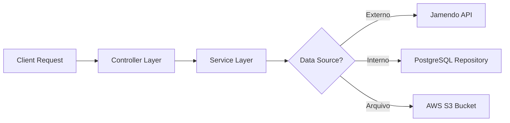

# 🌌 Arcturus Stream API

> **Backend RESTful desenvolvido em Java e Spring Boot para a plataforma Arcturus Stream.**


---

## ⚙️ Sobre a API

Este é o servidor responsável por toda a lógica de negócios, persistência de dados e integração com serviços externos (AWS S3 e Jamendo API) do projeto **Arcturus Stream**.

A aplicação foi construída seguindo os princípios de **Clean Architecture** e **SOLID**, expondo endpoints REST seguros e otimizados para consumo pelo client Frontend.

### 🔗 Integração
O Frontend que consome esta API pode ser encontrado aqui: (https://github.com/mariannacrocha/arcturus-front)

---

## 🛠 Tech Stack

* **Linguagem:** Java 21
* **Framework:** Spring Boot 3.4
* **Build Tool:** Maven
* **Database:** PostgreSQL (Cloud: Neon Tech)
* **Storage:** AWS S3 (Amazon Simple Storage Service)
* **Containerização:** Docker (Multi-stage build)
* **Deploy:** Render

---

## 🔌 Endpoints Principais

| Método | Rota | Descrição |
|---|---|---|
| `GET` | `/v1/contents` | Lista todas as músicas salvas no banco de dados. |
| `GET` | `/v1/contents/search?q={termo}` | Busca músicas na API externa (Jamendo) e formata para o padrão interno. |
| `POST` | `/v1/contents` | Salva uma nova música na biblioteca pessoal (Banco + S3). |

---

## 🚀 Como Rodar Localmente

### Pré-requisitos
* Java JDK 21
* PostgreSQL (Local ou Docker)
* Maven

### 1. Clone o repositório
```bash
git clone https://github.com/mariannacrocha/arcturus-api.git
cd arcturus-api
```

--- 
### 2. Configure as Variáveis de Ambiente
Você precisa configurar o acesso ao banco e à AWS no seu arquivo application.properties ou via variáveis de sistema:

# Exemplo de variáveis necessárias
SPRING_DATASOURCE_URL=jdbc:postgresql://localhost:5432/arcturus_db
SPRING_DATASOURCE_USERNAME=postgres
SPRING_DATASOURCE_PASSWORD=sua_senha

# Configuração AWS S3
AWS_ACCESS_KEY=sua_chave_de_acesso
AWS_SECRET_KEY=sua_chave_secreta
AWS_REGION=us-east-1
AWS_S3_BUCKET=seu-nome-do-bucket

---
### 3. Execute a aplicação
```bash
./mvnw spring-boot:run
```
O servidor iniciará em: http://localhost:8080

---
### ☁️ Arquitetura de Dados
O fluxo de dados segue o padrão DTO (Data Transfer Object) para garantir que a estrutura interna do banco de dados não seja exposta diretamente na API.


---
### 👩‍💻 Autora

Desenvolvido por Marianna.

